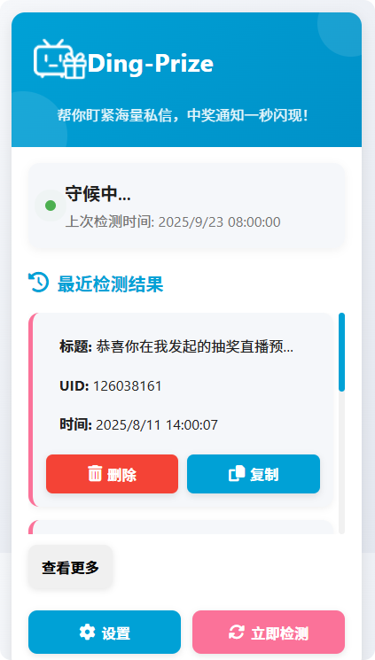

# Ding-Prize 


**Never miss a winning prize on Bilibili! / 再也不错过B站的中奖私信！**

`Ding-Prize` 是一款轻量级的浏览器扩展，它能帮助您监控B站（Bilibili）私信箱。当UP主给您发送中奖通知时，它会通过提醒的方式告知您，助您及时兑奖。



> **⚠️ 注意：当前为早期测试版本 (v0.1.0)**
> 该版本可能存在未知的Bug，我们非常期待您反馈使用中遇到的问题！请前往 [Issues](https://github.com/ItsTimeTooSleep/Ding-Prize---Your-Bilibili-Lottery-Notifier/issues) 页面创建新的反馈。

---

## ✨ 功能特点

-   **⏰ 定时检测**：在您浏览网页时，插件会按照设定的时间间隔自动检测私信，也支持手动点击检测。
-   **🔔 桌面通知**：一旦检测到包含“中奖”、“恭喜”等关键词的UP主私信，立即弹出桌面通知。
-   **🔗 一键直达**：点击通知即可快速跳转到B站私信页面，方便您快速回复或兑奖。
-   **🛡️ 安全隐私**：所有数据处理均在本地完成，无需担心隐私泄露。
-   **🧩 轻量易用**：安装简单，无需复杂配置。

## 🚀 安装

### 手动安装（开发者/测试版）

由于目前是早期版本，请通过以下方式进行手动安装：

1.  **下载项目代码**：
    -   点击仓库顶部的 `Code` 按钮，然后选择 `Download ZIP`。
    -   或者，如果您使用 Git，可以克隆本仓库：
        ```bash
        git clone https://github.com/ItsTimeTooSleep/Ding-Prize---Your-Bilibili-Lottery-Notifier.git
        ```

2.  **解压文件**：
    -   将下载的ZIP文件解压到您电脑上的任意文件夹。

3.  **加载扩展**：
    -   打开 **Chrome** 或 **Edge** 浏览器。
    -   在地址栏输入：`chrome://extensions/` 或 `edge://extensions/`，并回车。
    -   打开页面右上角的 **“开发者模式”** 开关。
    -   点击 **“加载已解压的扩展程序”** （Chrome）或 **“加载解压缩的扩展”** （Edge）按钮。
    -   在弹出的文件选择器中，选中您刚才**解压的文件夹**，然后点击“选择”。


## 🖥️ 使用说明

-   **手动检测**：点击 Ding-Prize 插件内部的“立即检测”按钮，即可立即触发一次私信检测。
-   **自动检测**：扩展安装后即会自动在后台运行，默认每 **二十四小时** 检测一次
-   **查看中奖信息**：您可以在插件内部查看到详细的中奖信息。

## 🐛 反馈与贡献

当前版本为 `v0.1.0`，是一个早期测试版，**可能存在诸多未知问题**（如检测失败、误报、通知不触发等）。

您的反馈对我们至关重要！如果您遇到任何问题或有改进建议：

1.  请先查看 [现有的 Issues](https://github.com/ItsTimeTooSleep/Ding-Prize---Your-Bilibili-Lottery-Notifier/issues) 是否已有类似问题。
2.  若没有，欢迎**创建一个新的 Issue**，详细描述您遇到的问题或想法。可以通过"点击-->插件管理-->检查视图："来获取详细的插件运行日志。


我们非常欢迎任何形式的贡献！如果您是开发者，欢迎 Fork 本项目并提交 Pull Request。

## 📜 开源许可

本项目采用 **MIT License** - 查看 [LICENSE](LICENSE) 文件了解详情。

### ❓ 常见问题
❓ 常见问题
<details> <summary><b>Q: 这款扩展收费吗？</b></summary> <b>A:</b> 完全免费和开源。 </details>
<details> <summary><b>Q: 它需要我的B站密码吗？</b></summary> <b>A:</b> 绝对不需要！扩展的工作原理依赖于您已经登录了B站网页版，它只会访问浏览器中已打开的B站页面所能访问的信息。 </details>
<details> <summary><b>Q: 扩展会收集我的个人数据吗？</b></summary> <b>A:</b> 不会主动收集。本扩展被设计为在您的浏览器本地运行，所有数据处理都发生在您的设备上。我们没有任何远程服务器用于收集或存储您的个人数据。 </details>
<details> <summary><b>Q: 扩展的权限为什么需要“读取和更改网站数据”？</b></summary> <b>A:</b> 这是核心功能所必需的。此权限允许扩展访问“https://api.vc.bilibili.com/*”，以获取用户的私信数据。它<strong>仅针对B站相关域名</strong>生效，不会也无法监控您在其他网站上的活动。 </details>
<details> <summary><b>Q: 支持哪些浏览器？</b></summary> <b>A:</b> 主要支持基于Chromium内核的浏览器（如最新版的Chrome, Edge, Arc等）。Firefox支持情况请查看GitHub页面。 </details>
<details> <summary><b>Q: 会导致黑号吗？</b></summary> <b>A:</b> 本扩展只使用基本私信api，通过私信内容筛选出可能的中奖私信，并不涉及任何自动转发等操作。 </details>
<details> <summary><b>Q: 我可以参与贡献或提出新功能建议吗？</b></summary> <b>A:</b> 非常欢迎！这是一个开源项目，您可以通过GitHub的Issue或Pull Request功能参与贡献。 </details>

## 💕 赞助与支持

如果这个项目对您有帮助，或者您希望支持它的持续开发，可以考虑通过以下方式赞助作者：
{:width="300px"}

[](https://afdian.com/a/itstimetoosleep)

您的支持将是我持续更新和维护项目的最大动力！

### 🙏 赞助者与支持者

感谢以下慷慨的支持者：

<div align="center">


| 赞助者 | 链接 | 支持时间 |
|--------|------|----------|
| Bilibili@星月奈津Talita | [🔗 空间主页](https://space.bilibili.com/481234771) | 2025年9月 |
| Jacky Zhang | - | 2024年9月 |

</div>

---

## ⚠️ 免责声明

1.  **非官方产品**：本项目为个人开发并维护的**粉丝自制开源项目**，与哔哩哔哩（Bilibili）官方无关。所有功能均基于公开的网页端实现，**并非上海宽娱数码科技有限公司的官方产品、服务或组成部分**。

2.  **商标所有权**：“Bilibili”、“哔哩哔哩”以及相关徽标是**上海宽娱数码科技有限公司**在中国和/或其他国家的注册商标与知识产权。本项目的存在不构成任何形式的商标授权、许可或关联关系。

3.  **用户责任**：使用本扩展所产生的任何风险由用户自行承担。开发者不对因使用此扩展导致的任何直接或间接损失（包括但不限于账户异常、数据丢失等）承担责任。

4.  **技术目的**：本项目旨在通过合法技术手段**优化和增强用户体验**，遵循合理使用的原则。开发者致力于尊重哔哩哔哩平台的所有服务条款和社区规范。
