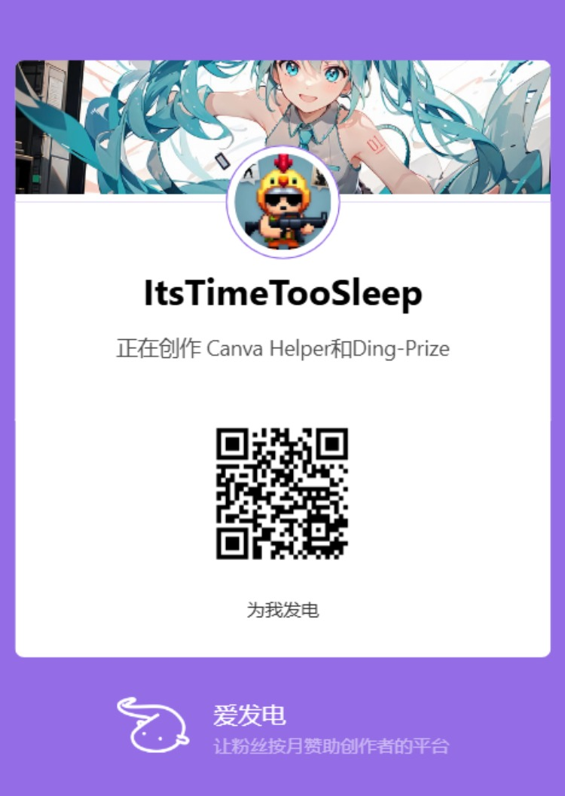

# Ding-Prize 

**不要让一次粗心辜负您上万次的转发！**

## 📖 简介
`Ding-Prize` 是一款轻量级的浏览器扩展，它能帮助您监控B站（Bilibili）私信箱。当UP主给您发送中奖通知时，它会通过提醒的方式告知您，助您及时兑奖。所有数据处理均在本地完成，无需服务器，保护您的隐私安全。

---

> **⚠️ 注意：当前为早期测试版本 (v0.4.0)**
> 该版本可能存在未知的Bug，我们非常期待您反馈使用中遇到的问题！请前往 [Issues](https://github.com/ItsTimeTooSleep/Ding-Prize---Your-Bilibili-Lottery-Notifier/issues) 页面创建新的反馈。

---
## ✨ 项目灵感

**Ding-Prize 的诞生，源于一次险些错过的运气和一位值得感谢的UP主。**

今年七月，我第一次在B站中奖，得益于UP主 **[锦鲤送瑞](https://space.bilibili.com/99584491)** ——他开发了一个能够自动扫描开奖动态并@中奖粉丝的工具。正是它的主动提醒，我才没有与那份好运失之交臂。

然而，不久前，**[锦鲤送瑞](https://space.bilibili.com/99584491)** 发布动态宣布项目停止更新。原因很简单，却也令人感慨：

> "云服务器到期了，一直为爱发电[脸红]，谢谢关注。"

这句话深深触动了我。一个惠及无数用户的好工具，却因持续的个人投入而难以为继。这让我意识到，依赖中心化服务器的服务存在天然的脆弱性。

因此，我萌生了开发 Ding-Prize 的想法，并确立了核心原则：

- **传承精神**：延续帮助用户捕捉运气的初衷
- **技术重构**：采用**本地化架构**，所有数据仅在用户浏览器中处理
- **可持续性**：无服务器成本，真正实现"一次开发，持续可用"

**Ding-Prize 是对 [锦鲤送瑞] 精神的延续，用不同的技术方案解决同一个用户需求。** 感谢所有为爱发电的开发者，是你们让技术充满了温度。

---

## ✨ 功能特点

-   **⏰ 定时检测**：在您浏览网页时，插件会按照设定的时间间隔自动检测私信，也支持手动点击检测。
-   **🔔 桌面通知**：一旦检测到包含“中奖”、“恭喜”等关键词的UP主私信，立即弹出桌面通知。
-   **🔗 一键直达**：点击通知即可快速跳转到B站私信页面，方便您快速回复或兑奖。
-   **🛡️ 安全隐私**：所有数据处理均在本地完成，无需担心隐私泄露。
-   **🧩 轻量易用**：安装简单，无需复杂配置。

## 🚀 安装

### 手动安装（开发者/测试版）
若还是看不懂可以查看[图文安装教程](docs/tutorial/installation/installation.md)

1.  **下载项目代码**：
    -   **方式一**：在仓库页面点击 `Code` → `Download ZIP`，获取最新代码。
    -   **方式二 （可下载旧版）**：前往 [GitHub Releases](https://github.com/ItsTimeTooSleep/Ding-Prize---Your-Bilibili-Lottery-Notifier/releases) 
        > 提示：Releases 文件与直接下载的 ZIP 包内容一致，区别在于版本管理。
    -   **国内用户备用链接**：若访问 GitHub 缓慢，可使用此123网盘链接下载最新版本压缩包：
        - 链接：`https://www.123865.com/s/Zfw8Td-5dYVv?pwd=NI5Z`

2.  **解压文件**：
    -   将下载的ZIP文件解压到您电脑上的任意文件夹。

3.  **加载扩展**：
    -   打开 **Chrome** 或 **Edge** 浏览器。
    -   在地址栏输入：`chrome://extensions/` 或 `edge://extensions/`，并回车。
    -   打开页面右上角的 **“开发者模式”** 开关。
    -   点击 **“加载已解压的扩展程序”** （Chrome）或 **“加载解压缩的扩展”** （Edge）按钮。
    -   在弹出的文件选择器中，选中您刚才**解压的文件夹里面的“Ding-Prize”文件夹**，然后点击“选择”。

## 🖥️ 使用说明

-   **手动检测**：点击 Ding-Prize 插件内部的“立即检测”按钮，即可立即触发一次私信检测。
-   **自动检测**：扩展安装后即会自动在后台运行，默认每 **二十四小时** 检测一次
-   **查看中奖信息**：您可以在插件内部查看到详细的中奖信息。

## 🐛 反馈与贡献

当前版本为 `v0.4.0`，是一个早期测试版，**可能存在诸多未知问题**（如检测失败、误报、通知不触发等）。

您的反馈对我们至关重要！如果您遇到任何问题或有改进建议：

1.  请先查看 [现有的 Issues](https://github.com/ItsTimeTooSleep/Ding-Prize---Your-Bilibili-Lottery-Notifier/issues) 是否已有类似问题。
2.  若没有，欢迎**创建一个新的 Issue**，详细描述您遇到的问题或想法。可以通过"点击-->插件管理-->检查视图："来获取详细的插件运行日志。

我们非常欢迎任何形式的贡献！如果您是开发者，欢迎 Fork 本项目并提交 Pull Request。

## 📜 开源许可

本项目采用 **MIT License** - 查看 [LICENSE](LICENSE) 文件了解详情。

### ❓ 常见问题
❓ 常见问题

 
<b>Q: 为什么我没有收到桌面通知？</b>
 <b>A:</b> 如果您确认扩展程序已正常运行且检测到中奖消息，但仍未收到桌面通知，请检查以下设置：
    <ul>
        <li><b>浏览器通知设置：</b> 确保您的浏览器（如 Chrome, Edge）允许“Ding-Prize”扩展发送通知。您可以在浏览器设置中找到“通知”或“网站设置”部分进行检查。</li>
        <li><b>操作系统通知设置：</b> 确保您的操作系统（Windows, macOS, Linux）没有禁用或静音来自浏览器的通知。检查系统的“通知与操作”或“通知”设置。</li>
        <li><b>“请勿打扰”模式：</b> 检查您的操作系统是否开启了“请勿打扰”模式或专注模式，这可能会暂时阻止通知的显示。</li>
    </ul>

 
<b>Q: 这款扩展收费吗？</b>
 <b>A:</b> 完全免费和开源。 

 
<b>Q: 它需要我的B站密码吗？</b>
 <b>A:</b> 绝对不需要！扩展的工作原理依赖于您已经登录了B站网页版，它只会访问浏览器中已打开的B站页面所能访问的信息。 

 
<b>Q: 扩展会收集我的个人数据吗？</b>
 <b>A:</b> 不会主动收集。本扩展被设计为在您的浏览器本地运行，所有数据处理都发生在您的设备上。我们没有任何远程服务器用于收集或存储您的个人数据。 

 
<b>Q: 扩展的权限为什么需要“读取和更改网站数据”？</b>
 <b>A:</b> 这是核心功能所必需的。此权限允许扩展访问“https://api.vc.bilibili.com/*”，以获取用户的私信数据。它<strong>仅针对B站相关域名</strong>生效，不会也无法监控您在其他网站上的活动。 

 
<b>Q: 支持哪些浏览器？</b>
 <b>A:</b> 主要支持基于Chromium内核的浏览器（如最新版的Chrome, Edge, Arc等）。其他浏览器目前没有做相关测验。 

 
<b>Q: 会导致黑号吗？</b>
 <b>A:</b> 不会。本扩展只使用基本私信api，通过私信内容筛选出可能的中奖私信，并不涉及任何自动转发等操作。 

 
<b>Q: 我可以参与贡献或提出新功能建议吗？</b>
 <b>A:</b> 非常欢迎！这是一个开源项目，您可以通过GitHub的Issue或Pull Request功能参与贡献。 

## 💕 赞助与支持

如果这个项目对您有帮助，或者您希望支持它的持续开发，可以考虑通过以下方式赞助作者：

您的支持将是我持续更新和维护项目的最大动力！

### 🙏 赞助者与支持者

感谢以下慷慨的支持者：

| 赞助者 | 链接 | 支持时间 |
|--------|------|----------|
| Bilibili@星月奈津Talita | [🔗 空间主页](https://space.bilibili.com/481234771) | 2025年9月 |
| Jacky Zhang | - | 2024年9月 |

---

## ⚠️ 免责声明

1.  **非官方产品**：本项目为个人开发并维护的**粉丝自制开源项目**，与哔哩哔哩（Bilibili）官方无关。所有功能均基于公开的网页端实现，**并非上海宽娱数码科技有限公司的官方产品、服务或组成部分**。

2.  **商标所有权**：“Bilibili”、“哔哩哔哩”以及相关徽标是**上海宽娱数码科技有限公司**在中国和/或其他国家的注册商标与知识产权。本项目的存在不构成任何形式的商标授权、许可或关联关系。

3.  **用户责任**：使用本扩展所产生的任何风险由用户自行承担。开发者不对因使用此扩展导致的任何直接或间接损失（包括但不限于账户异常、数据丢失等）承担责任。

4.  **技术目的**：本项目旨在通过合法技术手段**优化和增强用户体验**，遵循合理使用的原则。开发者致力于尊重哔哩哔哩平台的所有服务条款和社区规范。
