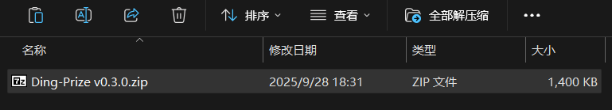
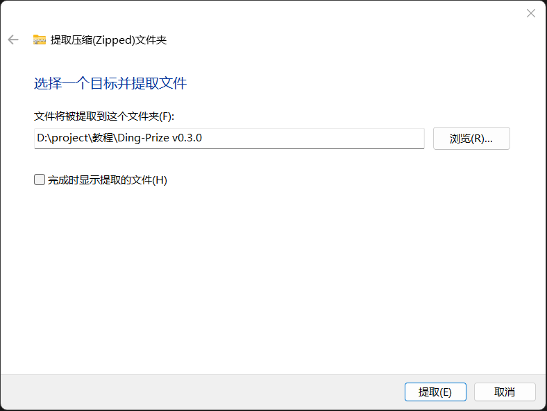
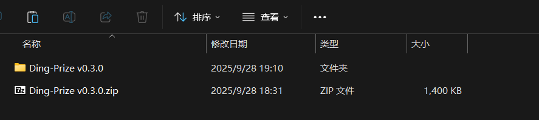
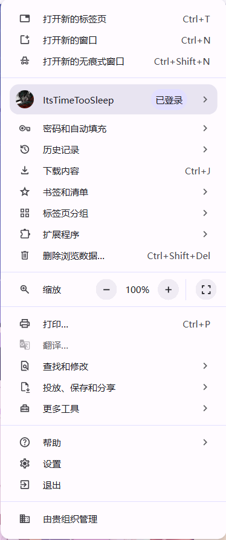
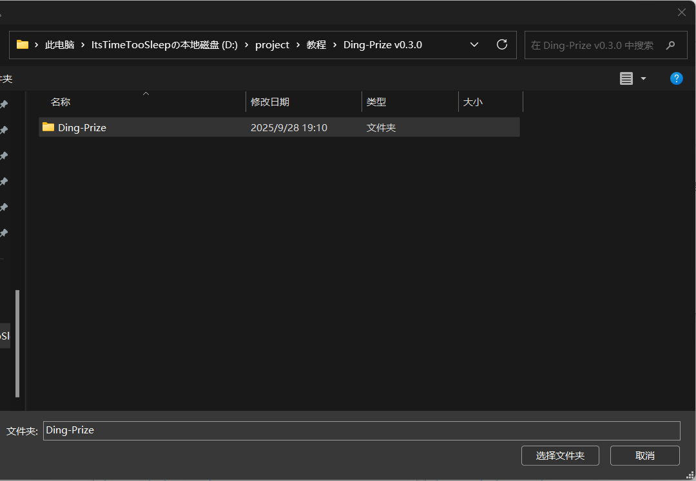
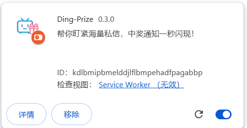

# 浏览器扩展安装教程

本教程将指导您如何下载并安装浏览器扩展。请按照以下步骤操作。
如有问题，欢迎询问[凌晨四点的睡教觉主](https://space.bilibili.com/3546761664661567?spm_id_from=333.40164.0.0)(●'◡'●)

## 第一步：下载扩展文件

1. 访问扩展下载页面，找到下载链接
    -   **方式一**：在仓库页面点击 `Code` → `Download ZIP`，获取最新代码。
    -   **方式二 （可下载旧版）**：前往 [GitHub Releases](https://github.com/ItsTimeTooSleep/Ding-Prize---Your-Bilibili-Lottery-Notifier/releases) 
        > 提示：Releases 文件与直接下载的 ZIP 包内容一致，区别在于版本管理。
    -   **国内用户备用链接**：若访问 GitHub 缓慢，可使用此123网盘链接下载最新版本压缩包：
        - 链接：`https://www.123865.com/s/Zfw8Td-5dYVv?pwd=NI5Z`

2. 点击下载按钮，将ZIP压缩包保存到您的电脑

## 第二步：整理和解压文件

### 创建专用存储文件夹
建议不要将扩展文件保留在下载文件夹中，请按以下步骤操作：

1. 在合适的位置（如D盘或文档文件夹）创建专用文件夹，例如："浏览器扩展"
2. 将下载的ZIP文件移动到此专用文件夹中

### 解压文件
1. 在专用文件夹中，右键点击ZIP文件
2. 选择"解压到当前文件夹"或使用解压软件解压

3. 等待解压完成，确保所有文件都成功提取

## 第三步：在浏览器中加载扩展

### 打开开发者模式 (这里以Chrome浏览器为例，Edge浏览器的步骤相似)
1. 打开Chrome浏览器，在地址栏输入：`chrome://extensions/`
2. 或者通过菜单：更多工具 → 扩展程序

3. 在扩展程序页面右上角，开启"开发者模式"

### 加载未打包的扩展程序
1. 点击"加载未打包的扩展程序"按钮

2. 在弹出的文件选择对话框中，导航到您刚才创建的专用文件夹。
3. 选择包含扩展文件的文件夹（确保该文件夹包含manifest.json文件）。一定要点进”Ding-Prize vx.x.x“文件夹，选择里面的“Ding-Prize”文件夹，不要选错啦`(*>﹏<*)′。

4. 点击"选择文件夹"确认

## 第四步：完成安装

1. 扩展现在应该出现在扩展程序列表中
2. 您可能会看到扩展已启用并在浏览器工具栏中显示图标

## 注意事项

- 确保您从官方或可信来源下载扩展
- 如果扩展无法正常工作，请检查是否已正确开启开发者模式
- 某些浏览器可能需要重启后才能完全启用扩展功能
- 如果遇到安全警告，请确认您信任该扩展的来源

## 故障排除

如果安装过程中遇到问题：

1. 重新检查所有步骤是否按顺序执行
2. 确认解压的文件完整且没有损坏
3. 尝试重新启动浏览器
4. 确保浏览器版本支持扩展功能

现在您已成功安装浏览器扩展！您可以开始使用扩展的功能了。祝您早日中奖！(๑•̀ㅂ•́)و✧